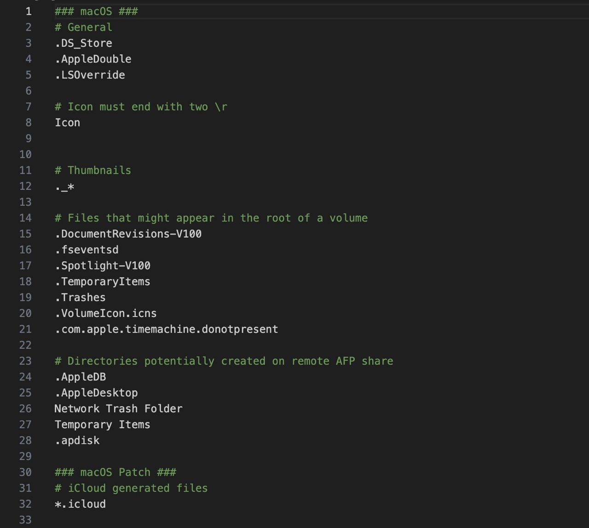
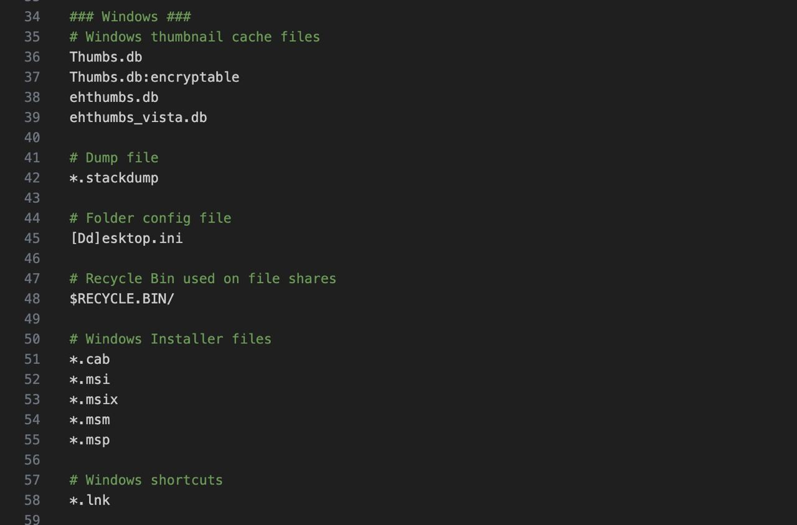
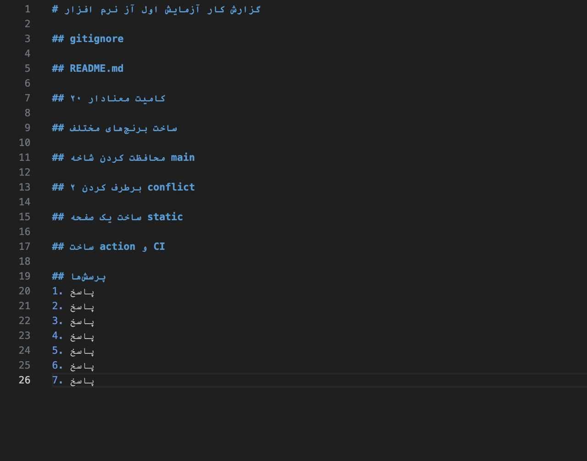
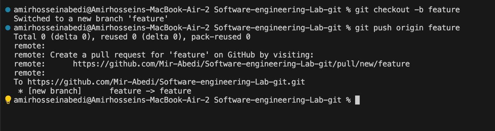
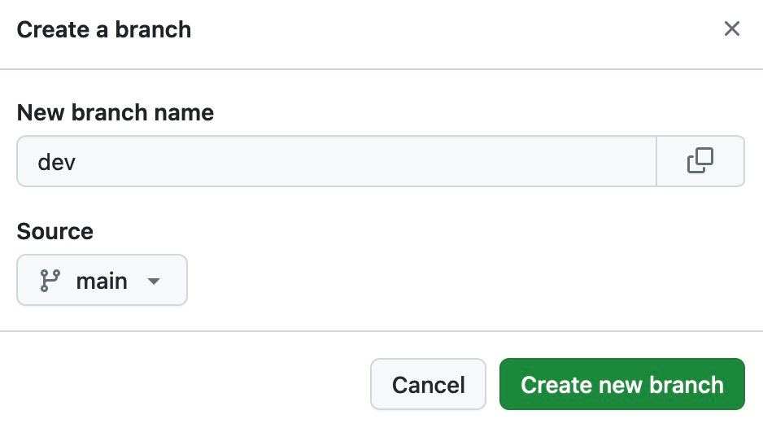
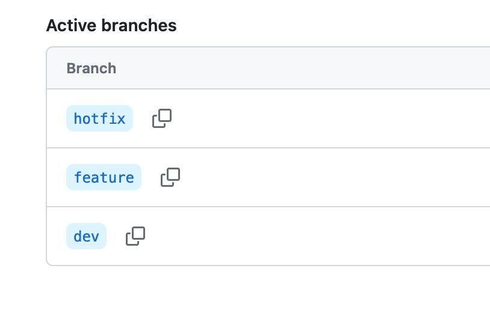
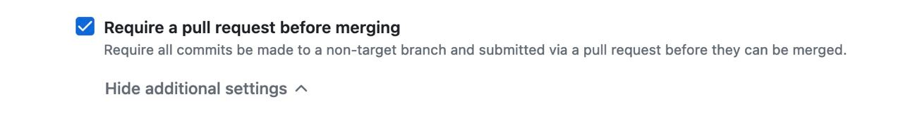
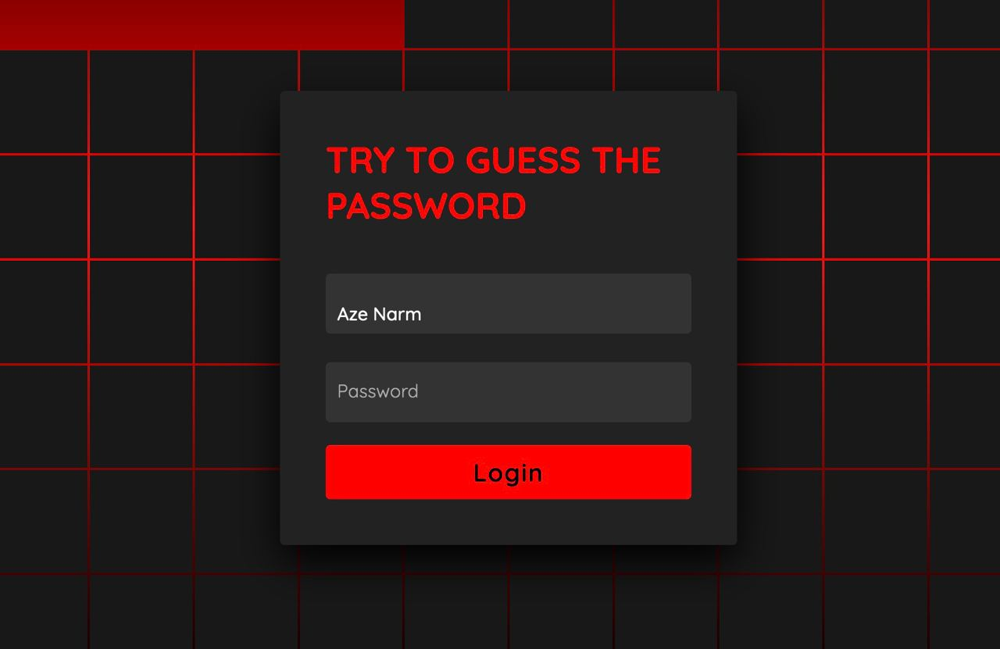
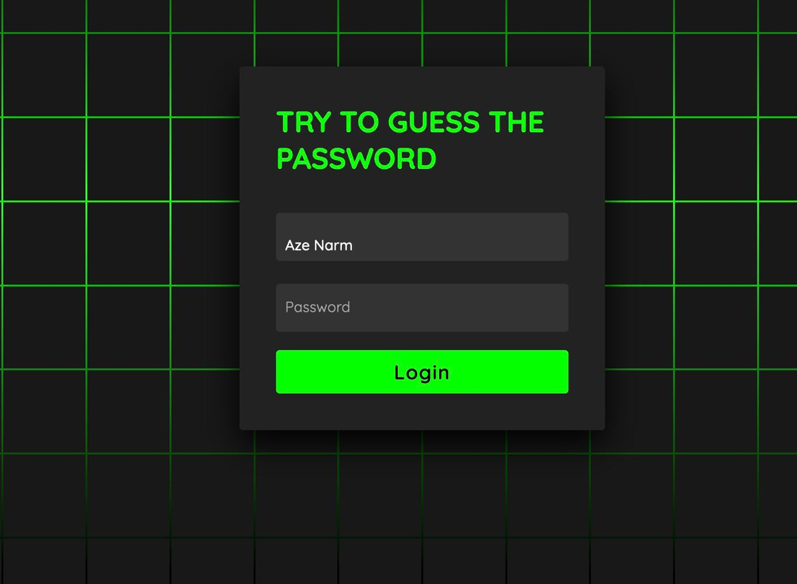
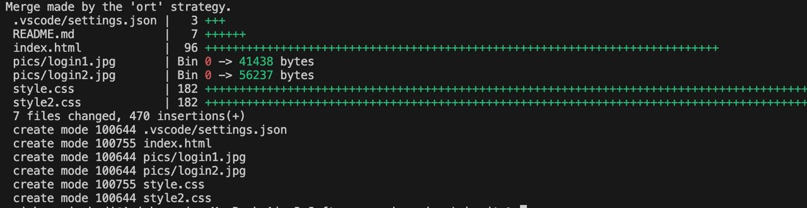

# گزارش کار آزمایش اول آز نرم افزار

## gitignore
برای ساخت .gitignore از ابزارهای آماده‌ای که برای اینکار وجود دارند استفاده می‌کنیم. وجود این فایل باعث می‌شود که فایل‌هایی که اسم و یا مسیری با یک الگوری مشخص دارند فیلتر شوند و وارد ریپازیتوری نشوند. مثالی از این نوع فایل‌ها، فایل‌های سیستم عاملی است که در اینجا با استفاده از [این لینک](https://www.toptal.com/developers/gitignore/api/macos,windows) این نوع فایل‌های سیستمی را فیلتر می‌کنیم.




## README.md
به طور کلی از این فایل که در اکثر مخزن‌ها وجود دارد، برای معرفی کار کدها و توضیح نحوه استفاده آن ها استفاده می‌شود. در این مخزن از فایل README برای نوشتن گزارش استفاده می‌کنیم و تمام مراحل را در این فایل توضیح می‌دهیم.


## ۲۰ کامیت معنادار

## ساخت برنچ‌های مختلف
قابلیت ایجاد شاخه‌های مختلف یکی از قابلیت‌های قوی گیت می‌باشد. این قابلیت این کمک را به توسعه‌دهندگان مختلف ارائه می‌دهد که بتوانند همزمان و در یک محیط ایزوله مستقل از دیگر محیط‌ها کد بزنند. همچنین این مزیت را هم دارد که شاخه اصلی می‌تواند باثبات باشد. برای ساخت شاخه جدید هم از GUI می‌توانیم این کار را انجام دهیم و هم از ترمینال


در نهایت شاخه‌های زیر را داریم که در ادامه درباره هرکدام توضیحاتی را ارائه می‌دهیم

- شاخه dev برای توسعه نسخه بعدی یک برنامه وجود دارد.
- شاخه feature شاخه‌ای موقت برای توسعه یک تسک مشخص است. معمولا این شاخه از dev گرفته می‌شود.
- شاخه hotfix برای درست کردن اضطراری باگ‌های موجود است.

## محافظت کردن شاخه main
برای اینکه شاخه main همواره stable باشد، این شاخه را محافظت‌شده می‌کنیم. برای اینکار در مخزن به تنظیمات می‌رویم و بعد در بخش rules یک protection rule برای این شاخه تعریف می‌کنیم و گزینه Require a pull request before merging را فعال می‌کنیم.



## برطرف کردن ۲ conflict

## ساخت یک صفحه static
در ابتدا یک برنچ جدید از برنچ dev جدا می‌کنیم که کار‌های ساخت وبسایت را بر روی آن انجام دهیم. در ابتدا یک صفحه خیلی ساده با یک دکمه لاگین می‌سازیم که هیچ فانکشنالیتی هنوز ندارد.

حال یک صفحه لاگین تمپلیت داریم و میخواهیم به آن فانکشنالیتی اضافه کنیم. با استفاده از تگ script به سایت فانکشنالیتی لاگین اضافه می‌کنیم و یک بازی حدس پسورد می‌سازیم که در صورت درست فهمیدن پسورد صفحه تغییر رنگ می‌دهد.

این صفحه به طور کامل توسط HTML و CSS ساخته شده است و کاملا static است. حال که وبسایت تکمیل شده‌است این برنچ را با برنچ dev مرج می‌کنیم.

با موفقیت با dev مرج شد و حالا می‌توانیم برای زدن pull request آماده باشیم.

## ساخت pull request برای merge با main

## ساخت action و CI
برای اینکه یک CI ابتدایی برای پروژه ایجاد کرده باشیم، یک Workflow جدید برای چک کردن تایتل کامیت‌ها استفاده می‌کنیم. به همین منظور ابتدا در پروژه یک فایل 
`commit-message-check.yml`
در پوشه 
`.github/workflows`
ایجاد می‌کنیم و کانفیگ مورد نظر خورد را در آن با توجه به سینتکس گیتهاب اضافه می‌کنیم. برای مشاهده این کانفیگ به مسیر گفته شده مراجعه کنید. با اضافه شدن این workflow به پایپ‌لاین‌های مخزن گیتهاب از این به بعد نیاز داریم کامیت‌های خود را با یکی از تایتل‌های feat، fix، chore، refactor یا docs استفاده کنیم. نمونه‌هایی از تایتل یک کامیت صحیح و ناصحیح در زیر نوشته شده:

```
Valid Commit Message:


1. fix: correct typo in documentation
2. feat: add new user authentication feature
3. refactor: improve code structure in user service
4. fix: resolve issue with login functionality
5. chore: update dependencies
6. docs: update README file


Invalid Commit Message:


1. update: change button color
2. bugfix: fix issue with data fetching
3. style: format code according to style guide
```

## پرسش‌ها
1. پاسخ
2. پاسخ
3. پاسخ
4. پاسخ
5. پاسخ
6. پاسخ
7. پاسخ